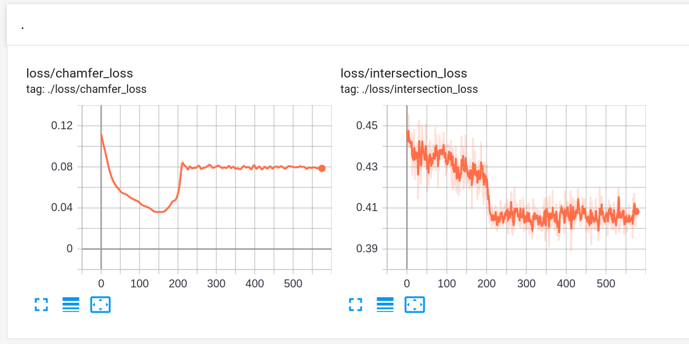
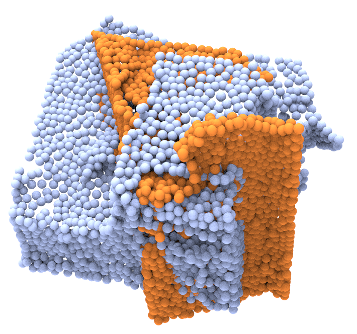
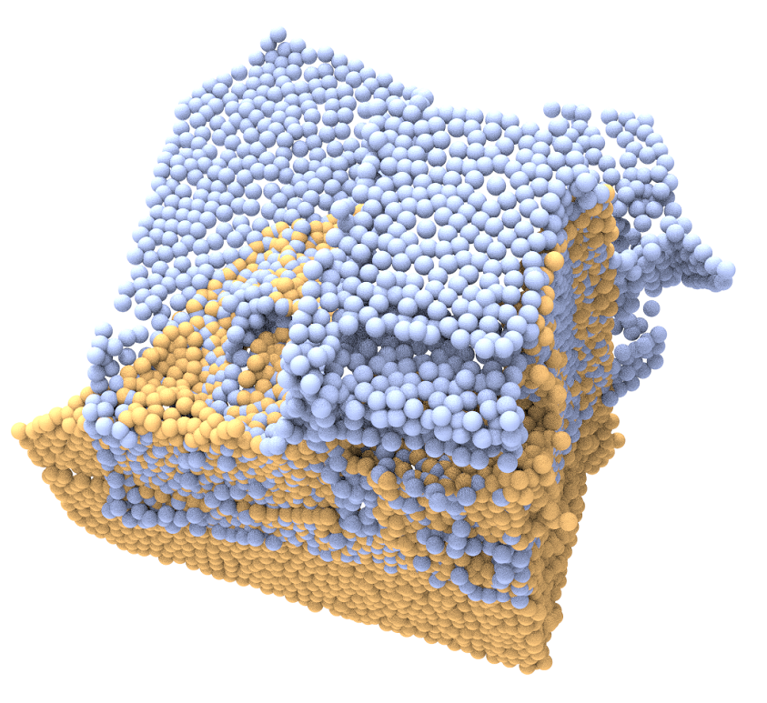

## Optimized a single case by our metric
Optimize the comparison between a single example and Chamfer-Distance.
- We can see that Chamfer-distance does not decrease monotonically during our optimization process.
- The optimal result of our optimization does not correspond to the minimal Chamfer distance.

The above two points show that our metric is essentially different from Chamfer distance optimization.

 

