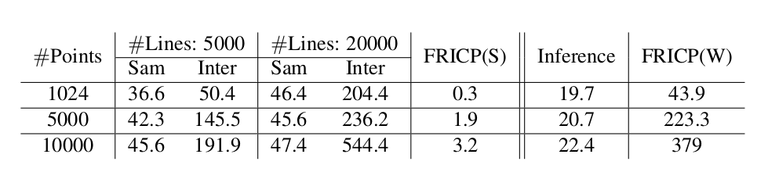

# A-robust-registration-loss
Deep learning, rigid registration, intersected lines, unsupervised learning, uniform distributions.

- Data prepartions 

  You can generate your own datasets by this [scipts](). Attention: We utilized denser to supervised our-network, avoid the ambiguity of the intersection of point cloud and straight line.
- Data

  You can download the [Human dataset](), [Airplane datasets](), [Real dataset]().
- Loss

  Our metrics have different versions from the beginning of the discussion. The overall research route is from mesh data to general point cloud data. The specific loss form can refer to [loss.py](./More_about_our_metrics/code_2021_8_25), it is very convenient to embed our metrics into other algorithm frameworks. Of course, You can test and research based on our different versions of metrics. We also provide an [svd version](./More_about_our_metrics/code_2021_8_25) of this metric, but its effect is somewhat deviated from the direct use of stochastic gradient descent.
- Experiments
  - Optimization of a single example by embedding the metric into the traditional optimization based on Adam.[Exp1](./More_about_our_metrics/code_2021_8_25)
  
  - Embed our metrics into deep learning and transform supervised frameworks into unsupervised frameworks,([RMP-Net](), [DCP](), [FMR]()).[Exp2]()

  We also provided the [pretrained models](),
- Cost computation
  
  We also provide some calculation cost tests that we measure, At present, our time spent mainly lies in the process of finding the intersection of a straight line and a point cloud.

- Visualize point cloud tools
  
  Our visualized was implemented with [Keyshot](https://www.keyshot.com/), we also provide some scripts to help point cloud rendering.[scirpts](./visualized_code/test.bip). The teaser figure was implemented with the lighter lib [Vedo](https://github.com/marcomusy/vedo).

- Acknowledgement

  We would like to thank the authors of [DCP_code](https://github.com/tzodge/PCR-CMU/tree/main/DCP_Code), [RPM-Net_code](https://github.com/tzodge/PCR-CMU/tree/main/RPMNet_Code), [FMR_code](https://github.com/XiaoshuiHuang/fmr), [FRICP](https://github.com/yaoyx689/Fast-Robust-ICP), [FGR](https://github.com/isl-org/FastGlobalRegistration) for making their codes available. 

  We can certainly thank the source of the data set, [Human dataset](https://secure.axyz-design.com//), [M40](https://github.com/zhirongw/3DShapeNets), Partial Real-datasets, [3D-Match](https://arxiv.org/pdf/1603.08182.pdf), [7scenes](https://openaccess.thecvf.com/content_cvpr_2013/papers/Shotton_Scene_Coordinate_Regression_2013_CVPR_paper.pdf), [SLAM](https://www.researchgate.net/publication/261353760_A_benchmark_for_the_evaluation_of_RGB-D_SLAM_systems).
